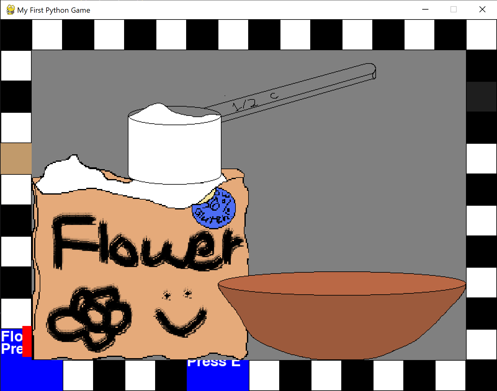
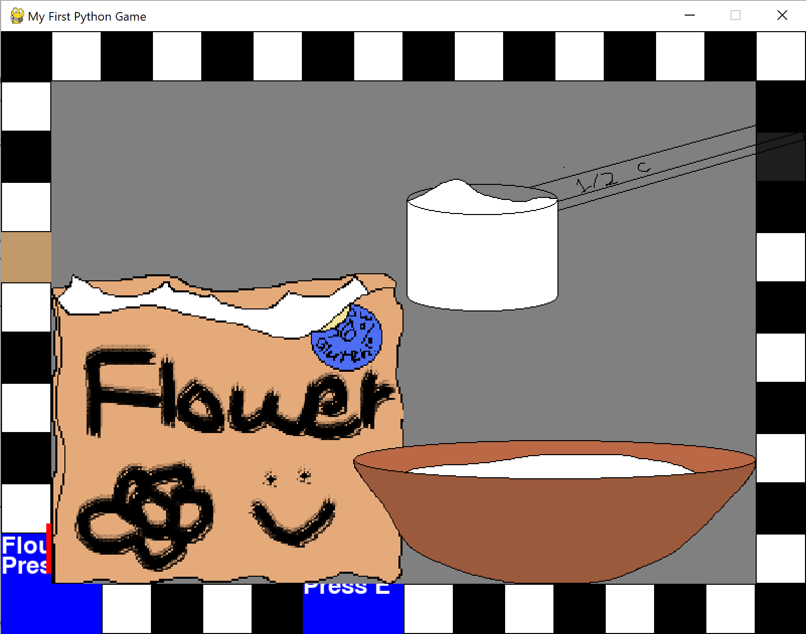
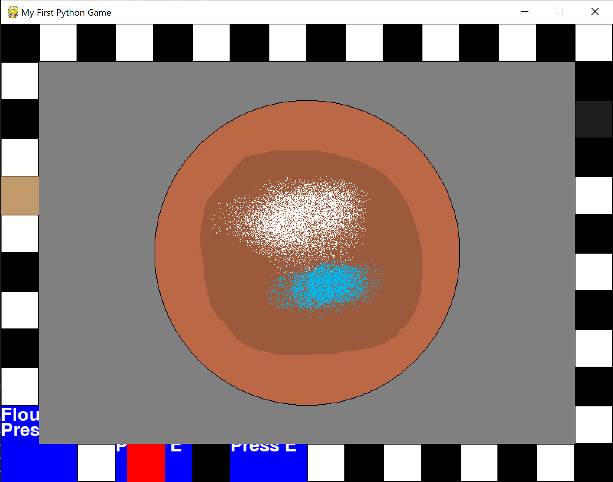
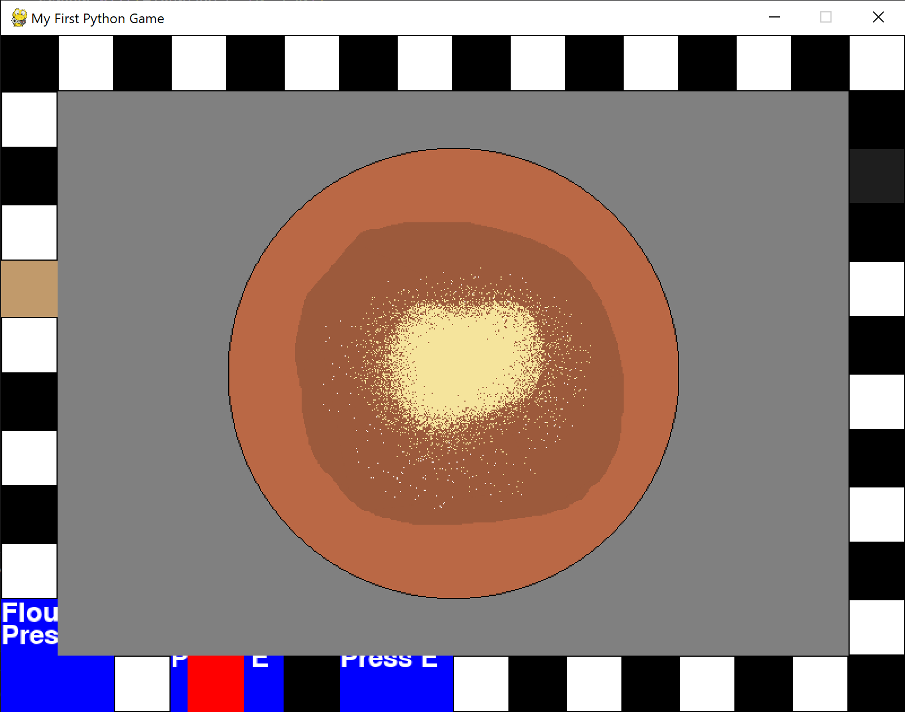
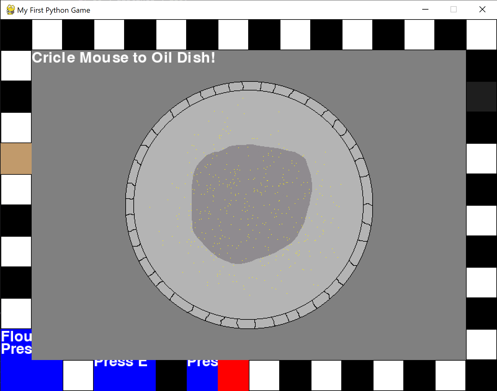
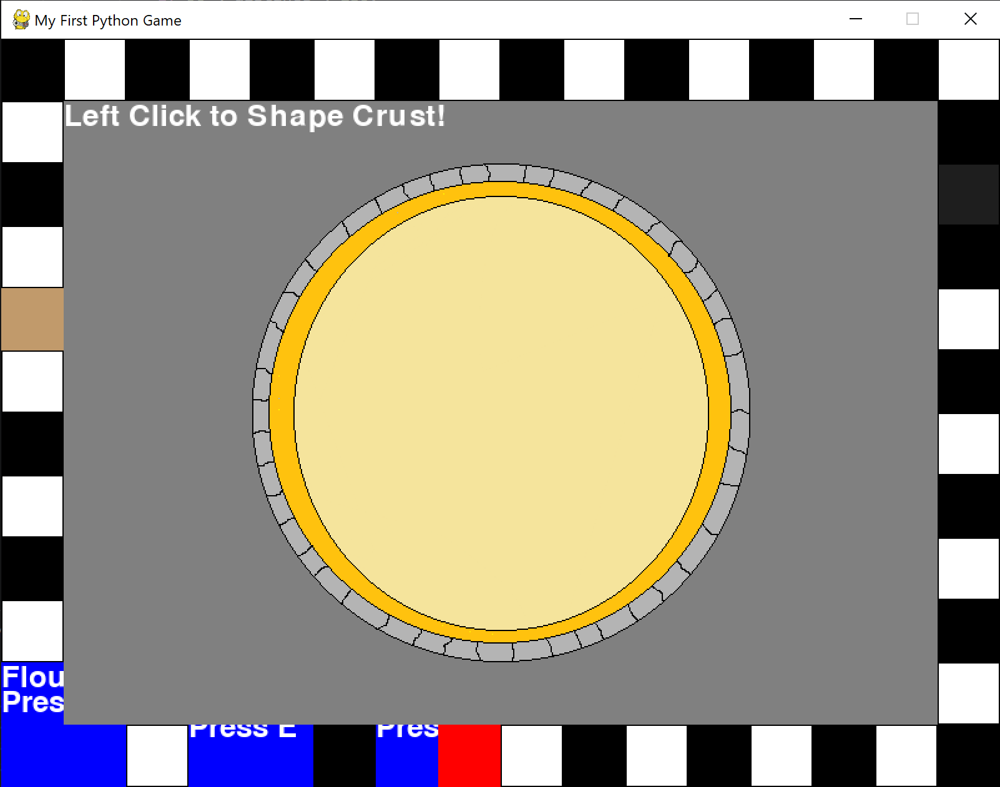
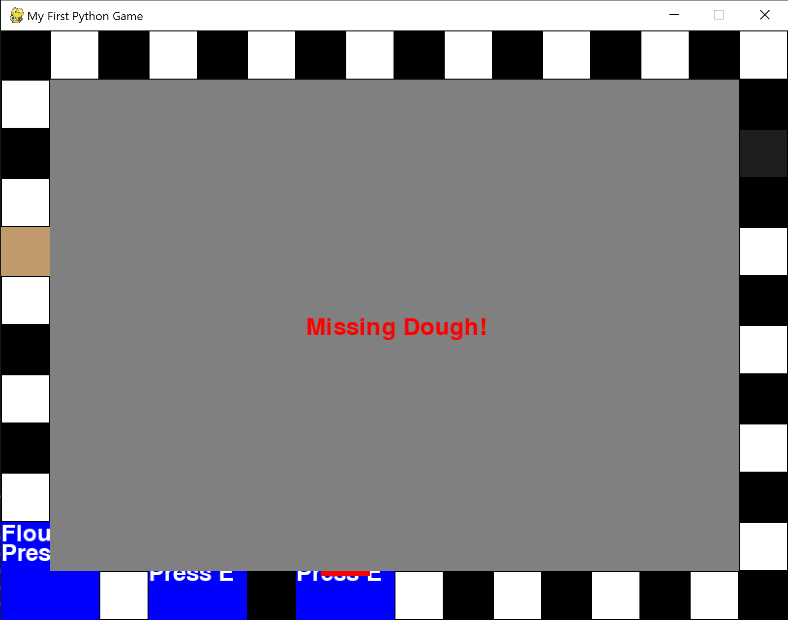
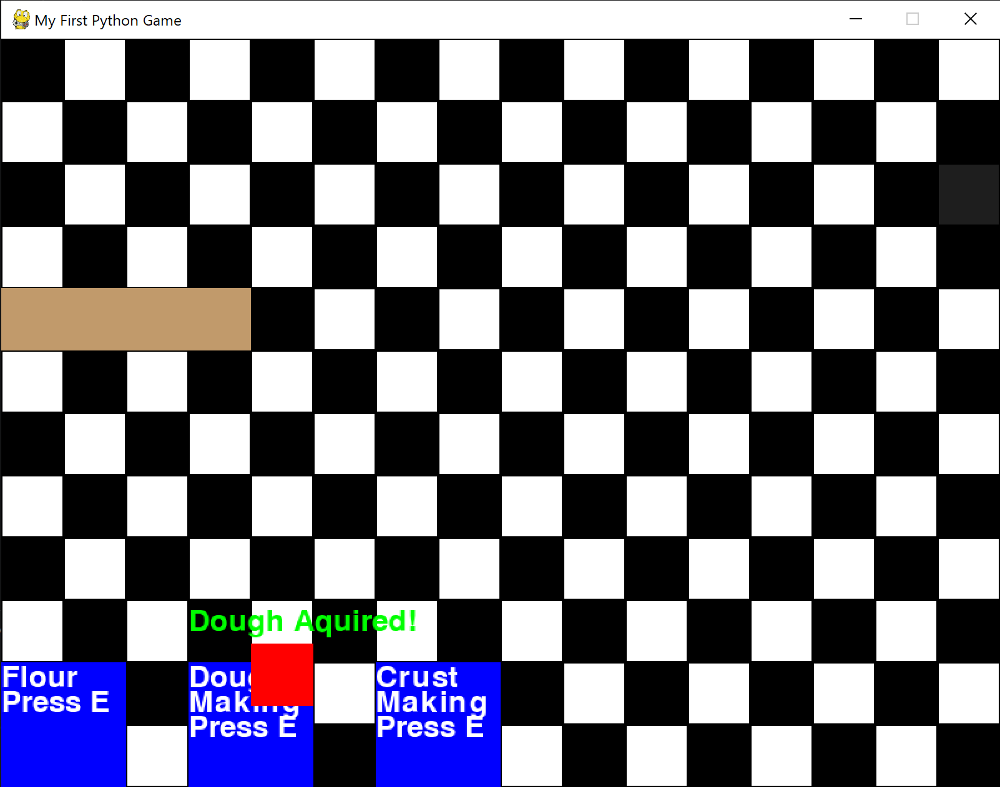
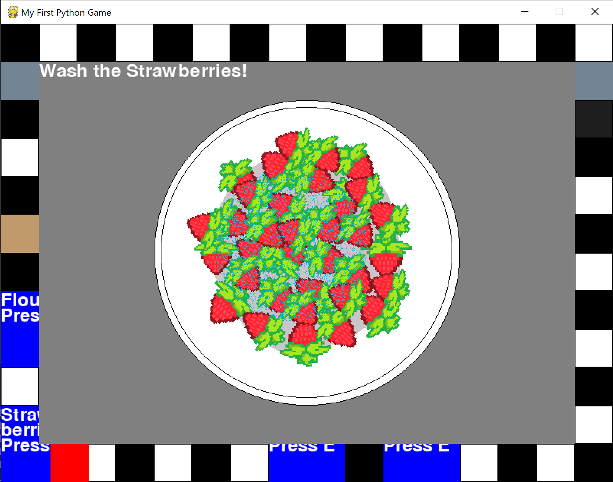
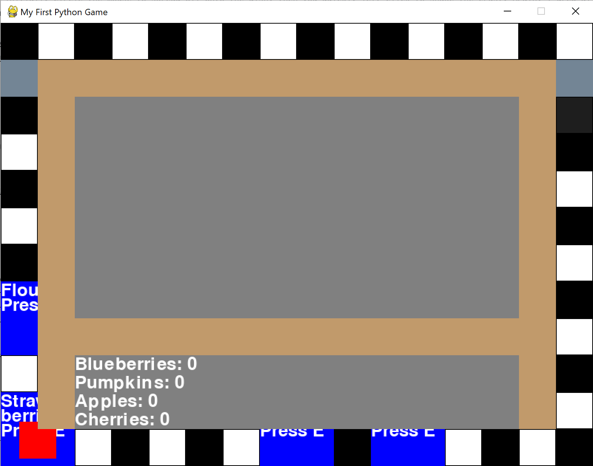

# Pie-A-Thon
Hi! Welcome to the Journal.md of my first software project, Pie-A-Thon! Read all about it in the Readme, I don't feel like saying it all again here. But you can watch its development here!

# Devlog 1
1h 5min 1sec Logged

I started making Pie-A-Thon today, a game where you work in a pie store, baking pies! It's my first software project, and I'm coding it in Python. I started off by getting used to the rules of Python and the PyGame add-on, which was easy, seeing how I have coded in C++ for my many Arduino projects. I made a simple sprite (a red cube) that can move around with ASWD. I made a wall with collision, and I made two stations for future minigames. My idea is that you need to get ingredients and prepare them and such. It's not much right now, but I think my game has potential!

# Devlog 2

1h 2min 19sec Logged

I added a background to the game (a checkered floor to make it feel more like a restaurant), and I added a minigame state. I figured out how to make drawn items different colors, and how to add pre-drawn sprites (I drew the BG!). I moved some of the minigame locations around, and I'll work on them next. I need to figure out how to get mouse inputs. 

# Devlog 3
1h 4min 22sec Logged

I figured out how to detect the actions of the mouse (click, position, and such) and I drew a bunch of sprites for the flour minigame! That's what took up the most time, drawing really isn't my thing. Still, I want this game to be fully my own, so I'm gonna have to draw (:

.png)

# Devlog 4

50 min 39sec Logged

I'm mostly finished with the flour minigame! I thought that moving the spoon with the mouse would be tricky, but it turned out it was really easy. I just plugged in mouse_x and mouse_y for the spoon's x and y coords, and it worked fine. With a little tuning, of course (x + yada yada and y - yada yada). This was a lot simpler than I thought! I guess Python is known for being simple, though. However, I am dealing with a glitch where the spoon seems to constantly be sensing that it is touching the flour bag. I will have to look into that. 

# Devlog 5
58m 17sec Logged

I finished the flour minigame! Turns out the bug was that the hitboxes of the sprites were drawn on top of each other and technically touching, while the actual sprites looked like they weren't. I fixed it and the flour minigame works well! I'll work on the crust minigame next.

 

# Devlog 6
1h 9min 47sec Logged

I made a dough minigame! That's right, I realized that you would need to make dough before shaping the crust. I wrote a complicated math algorithm to detect circles made by the mouse to detect kneading, which I totally didn't find on YouTube. I also had to draw many sprites to make the kneading interactive. Otherwise, it's more of the same knead-update-knead.

# Devlog 7
1h 8min 32sec Logged

I made the crust minigame! You initially circle the mouse to spread oil onto the dish, then you quickly left click to shape the crust. Again, I drew all the sprites. I added instructions on the top left of each minigame for user reference. 

# Devlog 8
41min 22sec Logged

I made some functional changes to my game! I made it so that you can't make dough before collecting flour, and that you couldn't make crust before making dough. I added neat warnings when you were missing ingredients and notifications when you picked them up. I'll add ingredient stations for fillings, a filling making station, and a pie assembly station before adding an oven. I'll also need to get to making the player sprite soon ToT. My ultimate goal is to add customers!

# Devlog 9
1h 23min 39sec Logged

I added a strawberry station to the game. You wash the strawberries and mash them to make a jam. Instead of a boolean for the acquisition, the strawberries are an integer, for customers may want multiple servings in their pie. I plan to add more fruits to the game. If room becomes a problem, I may replace individual fruit stations with an ingredient shelf. I honestly find the washing mechanic pretty boring after adding it, so I may get rid of it and add a jam maker to the game where you pour all your ingredients into a machine and crank a handle. I might add more ingredients next, or make a pie assembly station and an oven.

# Devlog 10
1h 46min 12sec Logged

I replaced the strawberry station with an ingredients station. I also got rid of strawberries entirely, and am instead using blueberries, cherries, pumpkins, and apples. I'll make a filler-making station next. I figured out how to update text real-time, so I can display how much of each ingredient the player has in the ingredient-gathering minigame. 

