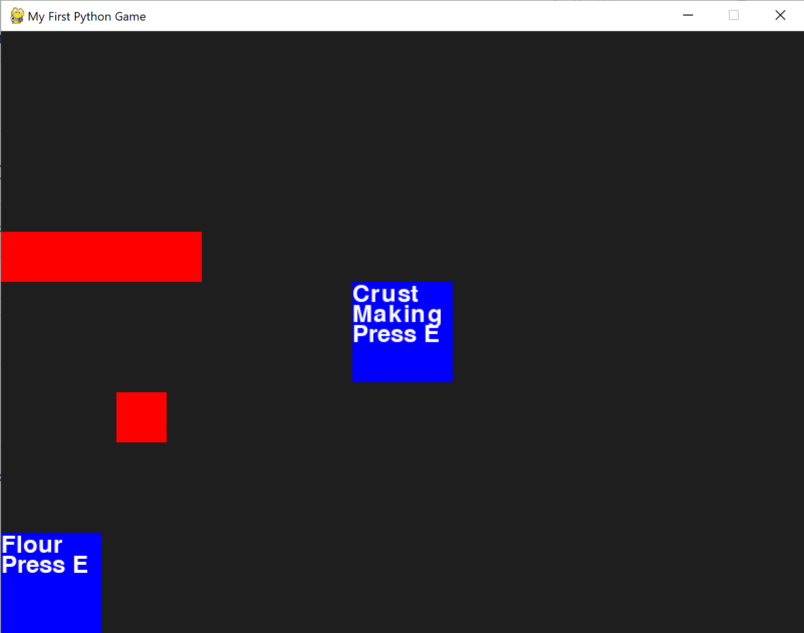
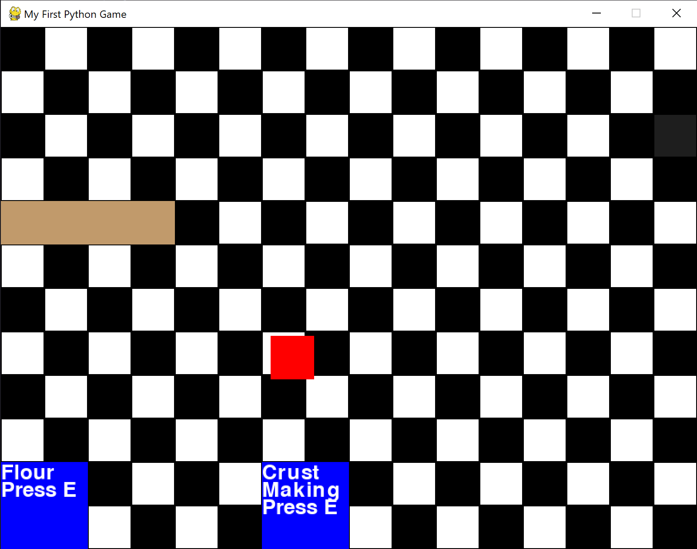

# Pie-A-Thon
Hi! Welcome to the Journal.md of my first software project, Pie-A-Thon! Read all about it in the Readme, I don't feel like saying it all again here. But you can watch its development here!

# Devlog 1
1h 5min 1sec Logged

I started making Pie-A-Thon today, a game where you work in a pie store, baking pies! It's my first software project, and I'm coding it in Python. I started off by getting used to the rules of Python and the PyGame add-on, which was easy, seeing how I have coded in C++ for my many Arduino projects. I made a simple sprite (a red cube) that can move around with ASWD. I made a wall with collision, and I made two stations for future minigames. My idea is that you need to get ingredients and prepare them and such. It's not much right now, but I think my game has potential!

# Devlog 2

1h 2min 19sec Logged

I added a background to the game (a checkered floor to make it feel more like a restaurant), and I added a minigame state. I figured out how to make drawn items different colors, and how to add pre-drawn sprites (I drew the BG!). I moved some of the minigame locations around, and I'll work on them next. I need to figure out how to get mouse inputs. 

# Devlog 3
1h 4min 22sec Logged

I figured out how to detect the actions of the mouse (click, position, and such) and I drew a bunch of sprites for the flour minigame! That's what took up the most time, drawing really isn't my thing. Still, I want this game to be fully my own, so I'm gonna have to draw (:

.png)
