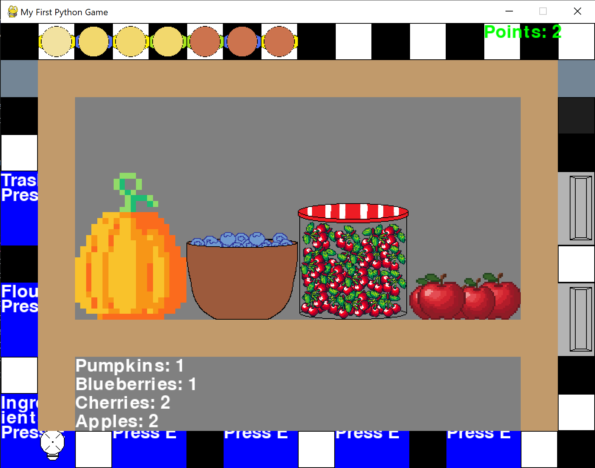
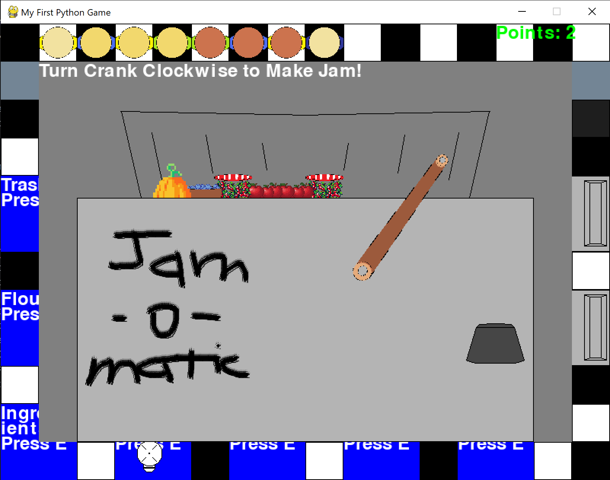
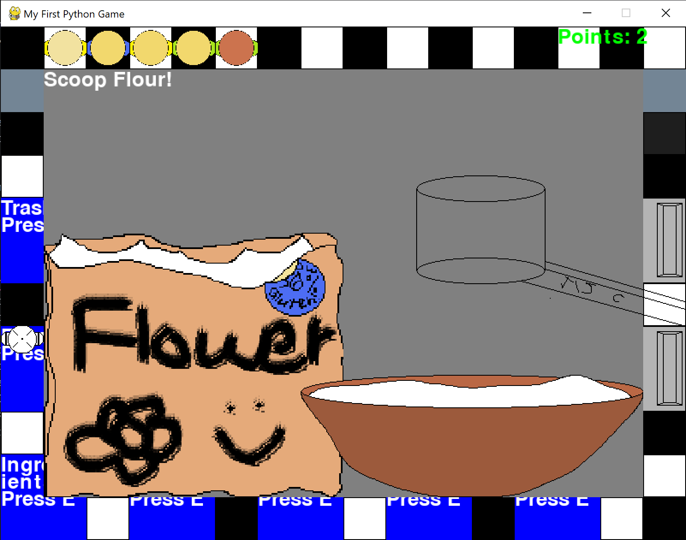
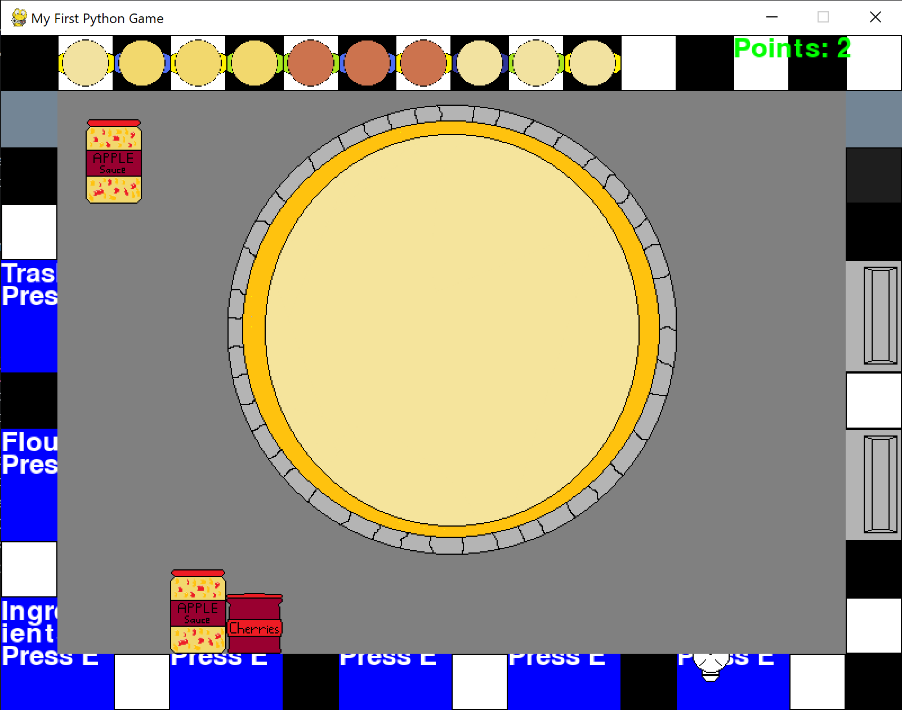
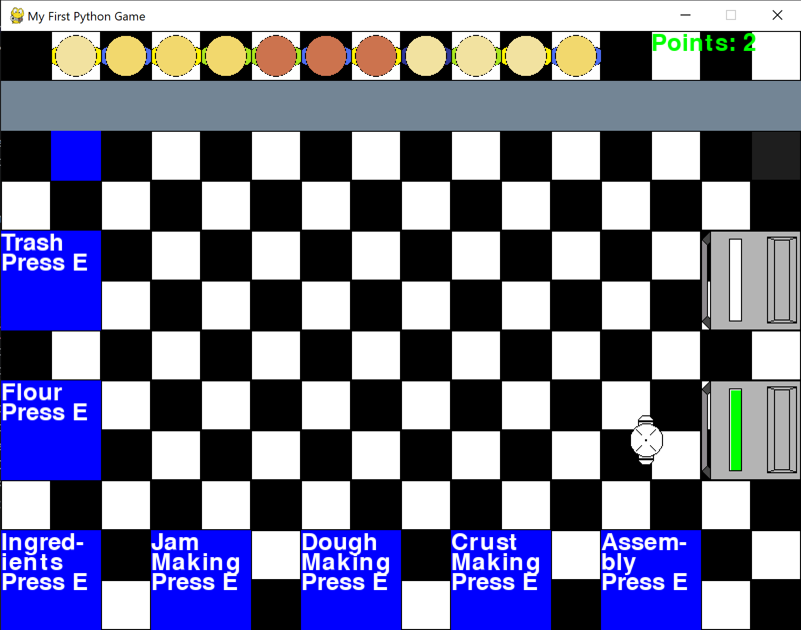
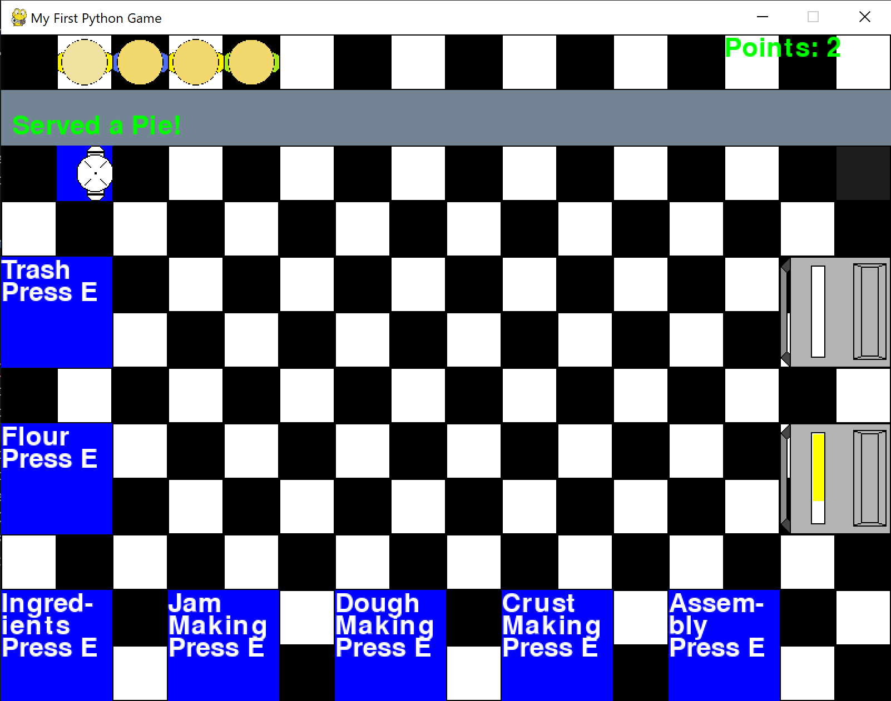

# Pie-A-Thon
My first software project, coded in Python! You bake pies in a pie restaurant, so that's why it's called the Pie-A-Thon! It also sounds like "Python" when you say it fast (:

# How To Play

There are two things you need in every pie: a crust and a jam. 

Get jams by collecting fruits at the ingredient station. 

Afterwards, go to the jam station and mash the fruits into jam by turning the Jam-o-Matic's crank. There are four types of fruit and thus four types of jam: apple, blueberry, cherry, and pumpkin. 

Start your crust by collecting three scoops of flour at the flour station. Drag the spoon between the bag of flour and the bowl.

Visit the dough and crust stations, in that order. You will get a crust. After collecting one crust and at least one jam, head over to the assembly station to assemble a pie. The crust will be in the center and the jams you have collected will be at the bottom. Select the jams you would like to use, and they will be moved to the side of the pie. Press "E" when you are done choosing. You will get an unbaked pie. The same will happen if you run out of jam. 

Head over to either one of the two ovens to bake your pie. They will take at least six seconds before the progress bar turns from yellow to green. That will mean that they are ready. You will have nine seconds before the progress bar turns red and the pie burns. Each oven may only bake one pie at a time. 

Serve the pie to your customers! Each served pie will give you one point. Try not to keep your customers waiting too long!

# Future Plans

In the future, I plan to add a customer ordering system where customers my order pies of specific flavors/combinations. I may also add a mechanism where customers may get angry if they wait too long and leave. Finally, I could potentially add a day-in ordering system and money so that you'll have to predict what customers will order and not go broke. All in all, this game has tons of potential!

# First-Run-Steps

Just download the Pie-A-Thon.zip file in the repository, or open the link here! 

https://github.com/leroyl6420-boop/Pie-A-Thon/raw/refs/heads/main/Pie-A-Thon.zip

Extract the contents, enter the Main folder and run Pie-A-Thon.exe! Your computer may try to stop you on account of potential viruses. Don't worry, there aren't any!* Just ignore the warnings, and have fun!

# AI Use

AI was used only to find bugs in this project. The AI in question is VS Code's free Copilot. 

*or are there?
